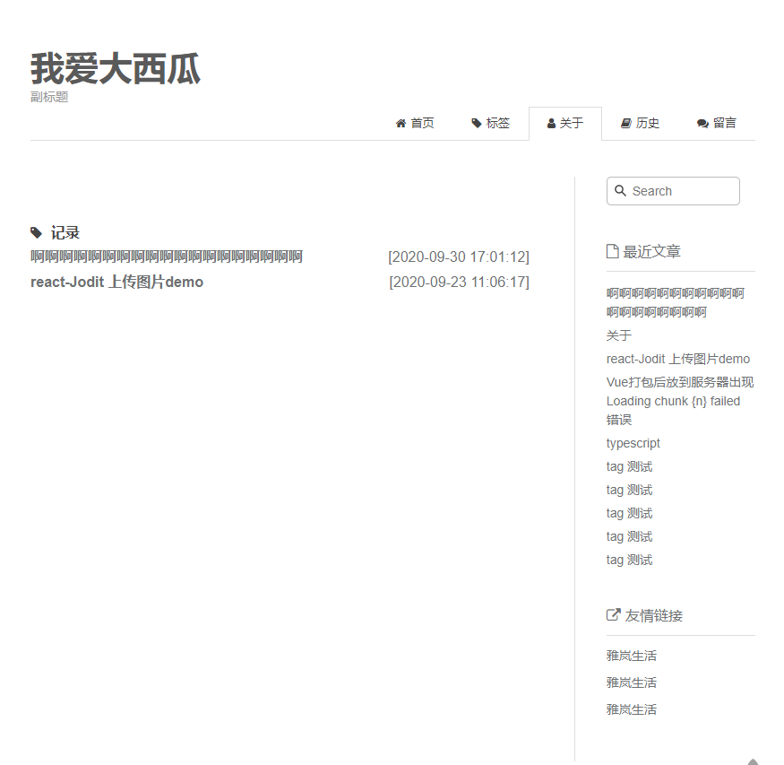
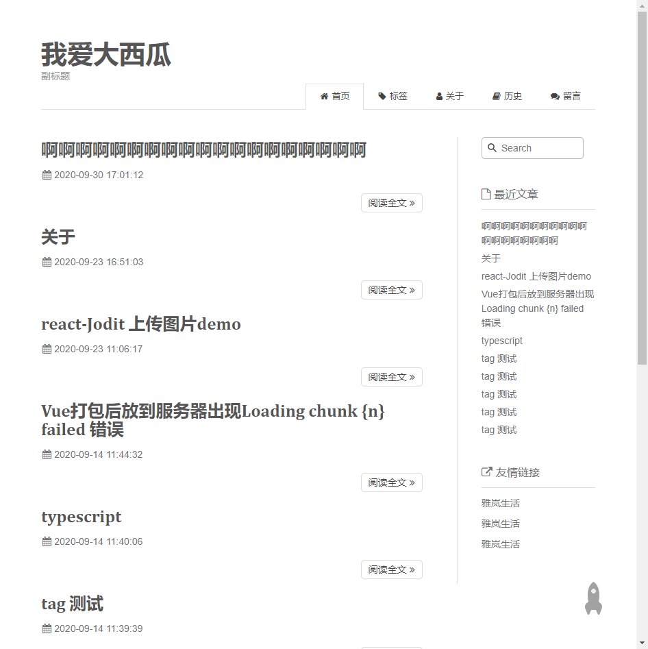
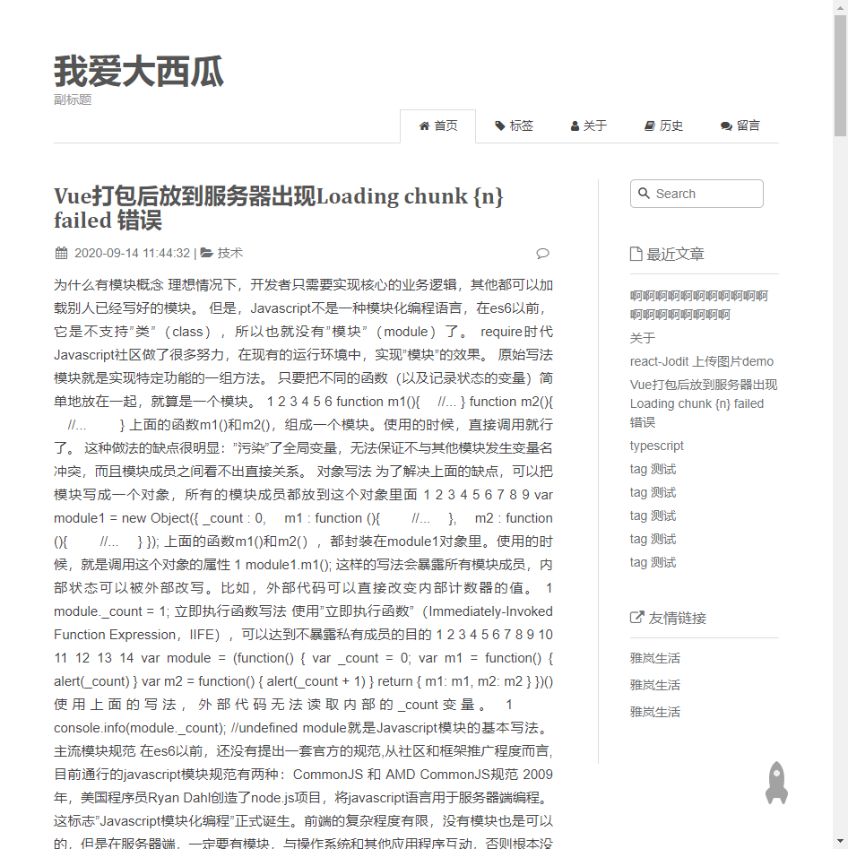
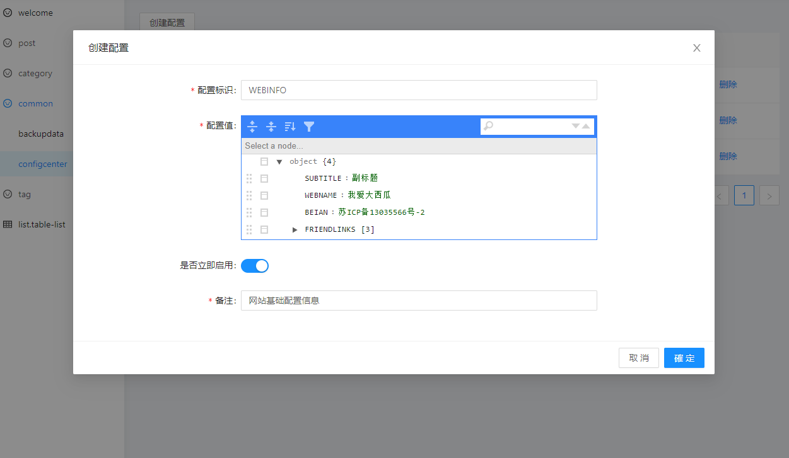
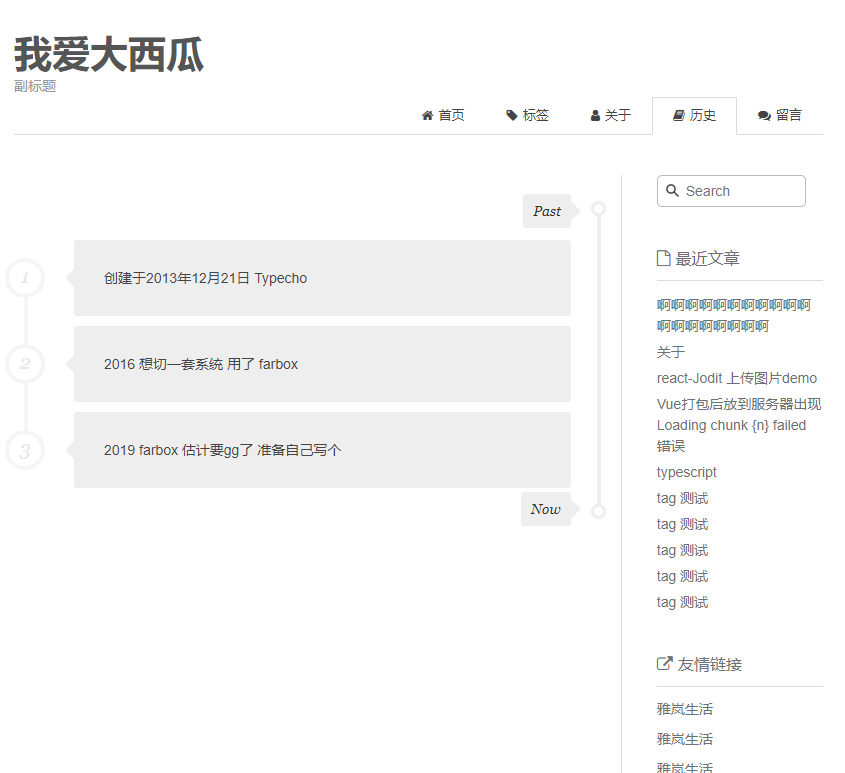
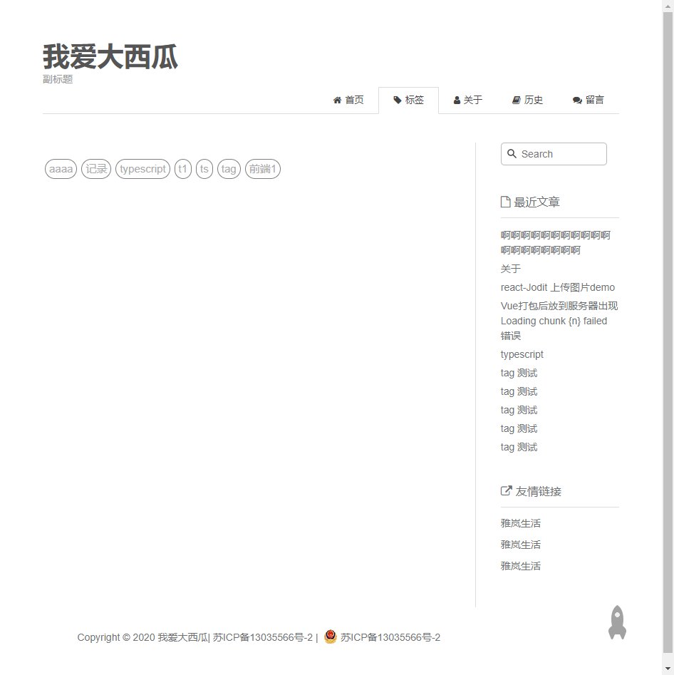

## 项目介绍

简单的 demo 包含了 文章的增删改查 登陆等

参考了 https://github.com/doramart/DoraCMS/ 的增删改查
参考了 https://www.haomwei.com/ 的 ui

## 目录结构

bff //api 接口

admin //react antdpro 后台

webts // nuxt 前台展示

## 技术栈

ts nuxt midwayjs react antd

## 开始

1、分别进入目录安装依赖

2、还原数据 --- 在 bff 目录 执行 node ./build/restore.js

3、

- bff ---npm run dev 开发
- admin ---npm start 开发
- webts ---npm run dev 开发
