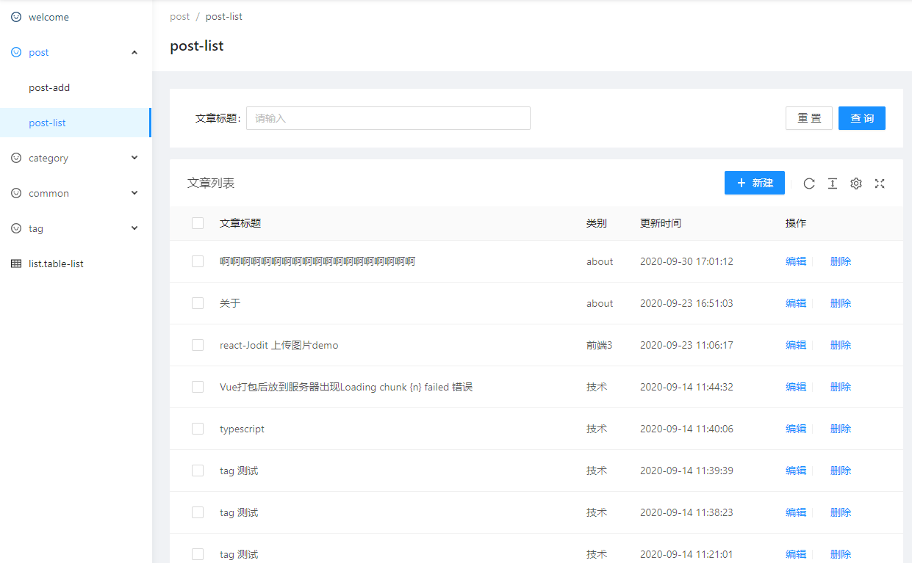

## 项目介绍

简单的 demo 包含了 文章的增删改查 登陆等

~~接口层用了 midwayjs 没想到刚 push 到 github 结果发布了 2.0~~
已经升级到 2.0

后台 antdpro 一直用很好用

前台展示用了 nuxt
都用 ts 写 但是 ts 也不是很会很多 interface 没有 类型都是 any

参考了 https://github.com/doramart/DoraCMS/ 的增删改查
参考了 https://www.haomwei.com/ 的 ui

## 目录结构

bff //api 接口

admin //react antdpro 后台

webts // nuxt 前台展示

## 技术栈

ts nuxt midwayjs react antd

## 开始

1、分别进入目录安装依赖

2、还原数据 --- 在 bff 目录 执行 node ./build/restore.js

3、

- bff ---npm run dev 开发
- admin ---npm start 开发
- webts ---npm run dev 开发
